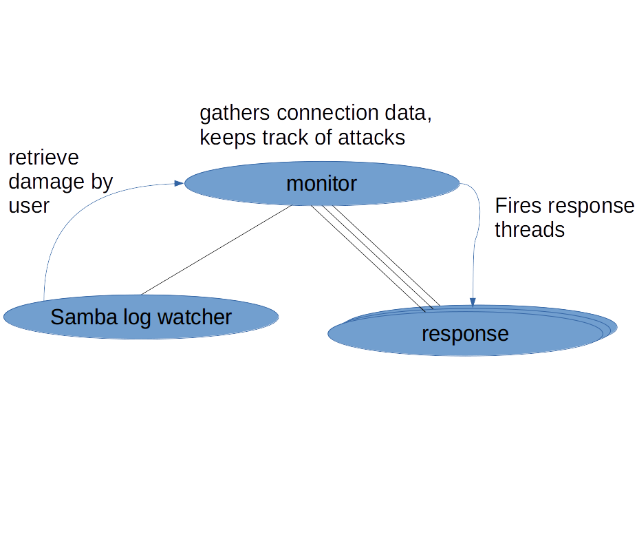

# Design Document for anti-cryptomalware share project

## Architecture

### The samba log watcher
We have a thread listening on the samba log whose path is provided in the config.
This module only keeps track of usernames and links them to damage.
A "damage" object is just a counter for (modified files, created files, deleted files).

### The monitor
The monitor runs on the main thread and gets polled at an interval defined in the config by a SIGALRM.
Every time the SIGALRM is received, we poll the `Samba log watcher` for the hashmap of user to accumulated damage.

The first job of the monitor is to gather data about the users ("attackers").
We use `smbstatus` to get IP addresses and `nbmlookup` to get hostname associated to those IPs (via the samba helper module).
A user may be connected from different hosts, that's why attacks are uniquely identified by the triplet `(username, ip, hostname)`.

### Attack objects
An `Attack` object is essentially a status (new, updated or over), an username, an ip, a hostname and the `Damage` object linked to it. The monitor keeps track of active attacks.

e.g. "attack status=new by user1 on 192.168.1.42 host=COMPUTER-42, 3 deleted files, 5 new files, 0 modified file."

### Response to attacks: which actions to take?
The monitor will then stamp a status to the attack (new, updated or over) depending on whether it existed, was active (and how long since the last update), and trigger the "response" module. This module is a thread that allows registering `response actions` to run a bunch of them when the response is triggered.

### Response actions
A response action is a class that follows the ResponseAction interface and handles attacks. It will be passed an attack as an argument. For instance it can be send an email, log to a file or write a report. You are free to create as many of these modules as you want, and you have to register them to the response module for them to be ran.

## Thread tree

